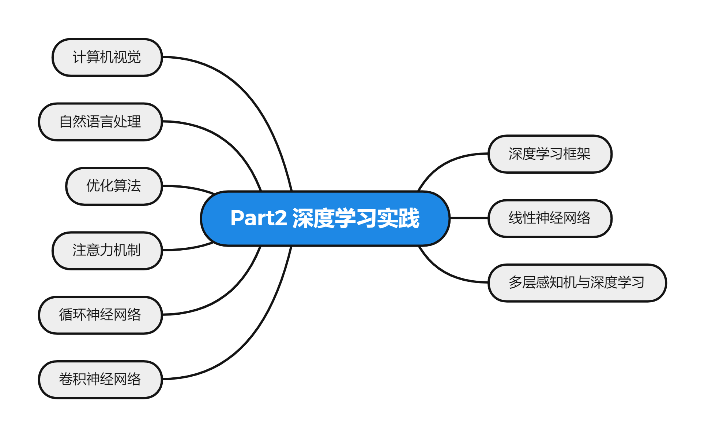

# Part2 Deep Learning Practice

> Part2 深度学习实践

**:information_desk_person:完整故事：**

在阅读本版块之前，需要读者掌握的先修知识：

* 基础的Python编程
* 基础数学课程（微积分，线性代数，概率论）

**:bellhop_bell:说明：**

* 本版块主要借助沐神的[动手学深度学习(d2l)课程](https://courses.d2l.ai/zh-v2/)与李宏毅的[机器学习系列课程](https://aistudio.baidu.com/aistudio/course/introduce/1978)。相关资料如下：
  * [d2l教程](http://zh.d2l.ai/)
  * [d2l中文开源项目](https://github.com/d2l-ai/d2l-zh)
  * [d2l英文开源项目](https://github.com/d2l-ai/d2l-en)
  * [李宏毅2021春季机器学习课程课件及作业](https://github.com/Fafa-DL/Lhy_Machine_Learning)
* 除了基础理论讲解外，版块还涉及**计算机视觉**和**自然语言处理**领域。由于个人精力有限，版块的重点会放在自然语言处理当中。若将来时间允许，也会对计算机视觉领域做深入讲解。
* 同时，**理论探究**的基础上，高度强调**动手实践**来实现。（目前主要使用**Pytorch实现**）

**:thought_balloon: 版块思维导图：**

