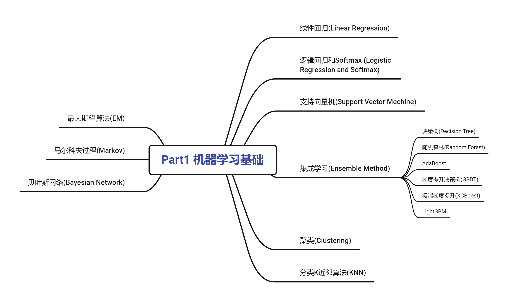

	  

    

        Machine Learning Park
	

# Machine Learning Park

> Gary 哥

## 介绍

> 本专栏主要分**三大版块**（Three Parts），主要用于分享与总结机器学习相关
>
> * **机器学习基础**
> * **深度学习实践**
> * **工业应用**

* 每个核心知识点都包含**知识讲解**和**代码实现**。
* 本专栏主要目的用于个人学习，亦不可以篇概全，请谅解，有问题可提出。
* 主要代码实现使用python，将同步到对应[github仓库：Machine-Learning-Park](https://github.com/Gary-code/MachineLearning)，代码尽量做到注释详细，有误请联系我并指出。
* 由于公式块编辑器的缘故，github在线预览的markdown说明文档公式显示会出现错乱，可以关注我[CSDN个人博客Machine Learning Park专栏](https://blog.csdn.net/garyboyboy/category_11485999.html)来查看对应的内容，或者下载对应文档，建议使用[Typora](https://www.typora.io/)打开。

## 版块内容简介

### Part1: 机器学习基础

**:thought_balloon: 思维导图展示：**

### Part2: 深度学习实践

**:bellhop_bell: 说明:**

* 本版块主要借助沐神的[动手学深度学习(d2l)课程](https://courses.d2l.ai/zh-v2/)与李宏毅的[机器学习系列课程](https://courses.d2l.ai/zh-v2/)。相关资料如下：
  * [d2l教程](http://zh.d2l.ai/)
  * [d2l中文开源项目](https://github.com/d2l-ai/d2l-zh)
  * [d2l英文开源项目](https://github.com/d2l-ai/d2l-en)
  * [李宏毅2021春季机器学习课程课件及作业](https://github.com/Fafa-DL/Lhy_Machine_Learning)
* 除了基础理论讲解外，版块还涉及**计算机视觉**和**自然语言处理**领域。由于个人精力有限，版块的重点会放在自然语言处理当中。若将来时间允许，也会对计算机视觉领域做深入讲解。
* 同时，**理论探究**的基础上，高度强调**动手实践**来实现。

**:thought_balloon: 思维导图展示：**

:hammer_and_wrench:**代码实现框架**：

- [x] Pytorch :hourglass_flowing_sand:
- [ ] Tensorflow :busstop:
- [ ] Others... :no_entry:

### Part3: 工业应用

**:notebook:本版块主要内容**：

* 实用机器学习技巧
* 数据科学相关的比赛

**:dart:内容描述：**

| 日期 | 内容 | 描述 | 封面 | coder(s) |
| ---- | ---- | ---- | ---- | -------- |
|      |      |      |      |          |

### :film_projector: 项目进展

| 所属板块           | 内容                                                         | 作者                                      |
| ------------------ | ------------------------------------------------------------ | ----------------------------------------- |
| Part1 机器学习基础 | [1 线性回归](https://github.com/Gary-code/Machine-Learning-Park/tree/main/1%20LinearRegression) | [Gary-code](https://github.com/Gary-code) |
| Part1 机器学习基础 | [2 逻辑回归与Softmax](https://github.com/Gary-code/Machine-Learning-Park/tree/main/2%20LogisticRegression%26Softmax) | [Gary-code](https://github.com/Gary-code) |
| Part1 机器学习基础 | [3 支持向量机](https://github.com/Gary-code/Machine-Learning-Park/tree/main/3%20SVM) | [Gary-code](https://github.com/Gary-code) |
| Part1 机器学习基础 | [4 集成方法](https://github.com/Gary-code/Machine-Learning-Park/tree/main/4%20Ensemble%20Method) | [Gary-code](https://github.com/Gary-code) |
| Part1 机器学习基础 | [5 聚类](https://github.com/Gary-code/Machine-Learning-Park/tree/main/5%20Clustering) | [Gary-code](https://github.com/Gary-code) |
| Part1 机器学习基础 | [6 K近邻算法](https://github.com/Gary-code/Machine-Learning-Park/tree/main/6%20KNN) | [Gary-code](https://github.com/Gary-code) |
| Part1 机器学习基础 | [7 贝叶斯网络](https://github.com/Gary-code/Machine-Learning-Park/tree/main/7%20Bayes%20Network) | [Gary-code](https://github.com/Gary-code) |
| Part1 机器学习基础 | [8 马尔科夫模型](https://github.com/Gary-code/Machine-Learning-Park/tree/main/8%20Markov) | [Gary-code](https://github.com/Gary-code) |
| Part1 机器学习基础 | [9 最大期望算法](https://github.com/Gary-code/Machine-Learning-Park/tree/main/9%20EM) | [Gary-code](https://github.com/Gary-code) |

:rocket:更新ing......

**联系我：**

邮箱：:email:1620216938@qq.com

博客：:memo:https://blog.csdn.net/Garyboyboy?spm=3001.5343

